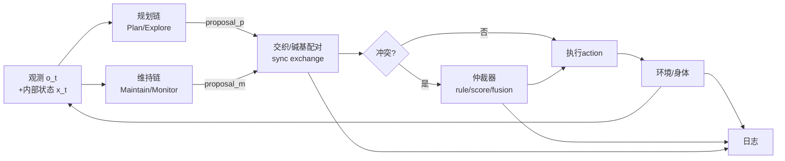
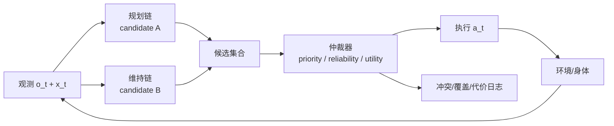
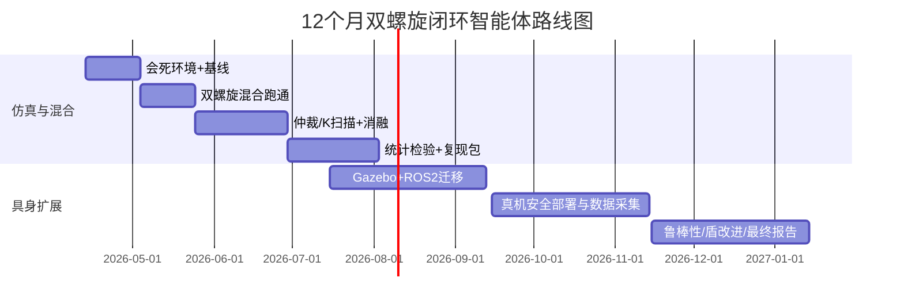

# 双螺旋思维链闭环智能体：双链交织架构的定义、变体与可复现实验设计

## 执行摘要与快速清单

**研究优先级建议：高（先做混合方案，再做纯模拟与具身）。**采用“双螺旋”双链把“长期规划/探索”与“实时维持/安全”解耦并交织，能在不训练大模型的前提下，用LLM API + 本地维持控制器在闭环自维持环境中做可统计检验，度量寿命、恢复率、冲突率与token/延迟成本。

**执行摘要（≤150字）**  
提出“双螺旋思维链”：两条并行交织链分别负责规划/探索与维持/安全，通过结构化消息互换与仲裁器在闭环自维持环境中协同。给出三类架构变体与三类可运行原型（仿真、混合、具身），以及可检验假设、统计检验与复现脚本骨架，用以判断系统何时从“死函数”转为“自维持/原始智能”。

**3点快速可执行清单（每点一句话）**  
- 用Gymnasium搭一个“会死”的虚拟体环境（能量-可行域-死亡），加单链基线先跑出生存曲线。citeturn3search0turn9search0turn7search0  
- 上线“双螺旋混合方案”：LLM低频产出宏计划，本地维持链高频执行+安全拦截，记录冲突/覆盖/恢复指标。citeturn0search2turn4search2turn5search1  
- 做消融与统计：去维持链、去仲裁、去共享记忆、限制token预算；用log-rank与bootstrap效应量证明差异。citeturn7search1turn7search2turn2search4  

**默认假设（未指定项）**  
软件环境默认 Linux + Python + PyTorch；仿真接口使用Gymnasium；LLM API示例以 entity["company","OpenAI","ai platform provider"] 的文档能力（结构化输出、prompt caching、Batch、速率限制与数据控制）为基准；具身原型默认 TurtleBot3 级差分底盘 + ROS 2 + Gazebo。citeturn3search0turn3search3turn3search2turn5search0turn2search0  

## 概念定义与动机

### 双螺旋思维链是什么

“双螺旋思维链（Double-Helix Interleaved Thinking Chains, DH-ITC）”是指在同一闭环智能体内并行运行两条推理/决策流，并以固定或事件驱动的“碱基配对（信息交换点）”进行交织：

- **规划/探索链（Plan/Explore Strand）**：面向长时程目标与新信息，生成宏观策略、子目标、技能选择与探索课程；  
- **维持/监控链（Maintain/Monitor Strand）**：面向自维持与安全约束，持续监测内部变量（能量、完整性、风险）、进行快速纠偏、拦截危险动作、触发紧急策略。

交织的关键不是“开两个模型”，而是**让两链在闭环中对同一具身/环境共享因果责任**：规划链改变未来状态分布，维持链定义“可以活下去的可行域（viability set）”与动作安全边界，从而把“智能涌现”从单一映射函数转化为可测的系统级动力学现象。citeturn9search5turn9search0turn9search10  

image_group{"layout":"carousel","aspect_ratio":"16:9","query":["DNA double helix diagram","dual loop control system diagram","hierarchical control loop architecture diagram"],"num_per_query":1}

### 关键属性与接口要点

双螺旋架构的“可研究化”取决于明确的系统属性（这些属性也构成后续消融与对照的维度）：

- **同步/异步**：两链是否同频运行（同步）还是规划链低频、维持链高频（异步）。  
- **信息交换频率**：每步、每K步、或仅在事件触发（风险升高/计划失败/能量骤降）。  
- **冲突解决**：当两链给出不同候选动作时，采用优先级（生存优先）、可靠性仲裁（谁更可信就谁控制）、或效用融合（加权组合）。这可类比神经科学中“模型基础 vs 模型自由”系统之间的仲裁思想：由预测可靠性决定控制权分配。citeturn4search1turn4search0  
- **记忆共享**：共享短期工作记忆（同一摘要状态/技能库/失败归因），还是各自维护私有记忆并仅交换压缩摘要。LLM智能体综述常把“设定、记忆、规划、行动模块”作为通用范式；双螺旋可视为把规划/行动与监控/约束进一步模块化并引入结构化协商接口。citeturn11view0  
- **接口格式**：建议用严格JSON Schema约束输出，避免闭环控制中因格式漂移导致的系统性故障；OpenAI Structured Outputs明确以JSON Schema保证结构粘合度（schema adherence），适合把LLM输出当作控制指令。citeturn15view0turn2search2  

### 与既有理论与系统的关系

- **与系统1/系统2（双加工）**：心理学双加工理论把认知加工区分为快速自动（Type 1）与缓慢受控（Type 2）；双螺旋可以工程化对应为“维持链≈快速反射/监控、规划链≈慢规划/推演”，并可通过交换频率与仲裁机制把“冲突”显式化为可测变量。citeturn0search19turn1search8  
- **与分层控制/层级强化学习（HRL）**：规划链相当于上层“选项/技能（options）”或子目标选择，维持链相当于下层执行与约束；Sutton等提出的options框架与Option-Critic为“宏动作+终止条件+上层策略”提供了形式化工具。citeturn1search3turn1search7turn1search1  
- **与ReAct**：ReAct强调把“推理轨迹”和“行动”交织以提升任务解决与可解释性；双螺旋把交织从“推理-行动”扩展为“规划/探索-维持/安全”两条并行链，并把冲突与仲裁显式纳入架构。citeturn0search0turn0search4  
- **与Voyager**：Voyager在Minecraft中通过自动课程（探索）、技能库（可复用宏行为）与迭代提示（利用环境反馈/错误/自检改进）实现长程闭环能力增长；双螺旋可把“探索课程/技能生长”放在规划链，把“生存约束/风险控制”放在维持链，并用统一指标衡量两者的互相牵制与协同。citeturn0search1turn0search13  
- **与SayCan**：SayCan把语言模型给出的技能相关性与价值函数给出的可执行成功概率结合来选择技能，实质上是“语义规划信号 + 可行性/成功率信号”的融合；这与双螺旋中的“规划链提案 + 维持链评估/拦截 + 仲裁融合”高度同构。citeturn0search2turn0search10  

## 架构变体设计

下面给出三种“可研究、可实现、可消融”的双螺旋变体；每种都配流程图、信息流说明、JSON Schema建议、频率/延迟建议与适用场景。为减少实现歧义，建议所有变体共享一套“消息信封（envelope）”，并按变体扩展字段；同时用Structured Outputs约束输出以降低闭环故障率。citeturn15view0turn2search2  

### 并行对称双链

**直觉**：两条链同频、对称，每个决策周期都给出候选与评估，类似“双人会诊”。适合研究“信息交换频率/冲突率/一致性”如何影响闭环性能，但token与延迟成本高。



**信息流要点**  
- 两链输入同一摘要状态（o_t, x_t），输出各自的**候选动作 + 风险/收益预测**。  
- 交织点（X）强制交换关键摘要：计划意图、禁止动作集合、风险上界估计。  
- 冲突由仲裁器处理：可用“生存优先”硬规则（维持链优先）或“可靠性加权”策略（见后述竞争仲裁）。citeturn4search1turn4search2  

**接口/消息格式建议（JSON Schema，示意）**  
（建议用Structured Outputs把下面schema作为响应约束；否则容易因字段缺失导致闭环崩溃。citeturn15view0turn2search2）

```json
{
  "type": "object",
  "required": ["strand", "t", "proposal", "estimates"],
  "properties": {
    "strand": {"type": "string", "enum": ["plan", "maintain"]},
    "t": {"type": "integer", "minimum": 0},
    "proposal": {
      "type": "object",
      "required": ["action_type", "action_params"],
      "properties": {
        "action_type": {"type": "string", "enum": ["macro", "micro", "terminate", "override"]},
        "action_params": {"type": "object"}
      }
    },
    "estimates": {
      "type": "object",
      "required": ["risk", "value"],
      "properties": {
        "risk": {"type": "number", "minimum": 0, "maximum": 1},
        "value": {"type": "number"},
        "confidence": {"type": "number", "minimum": 0, "maximum": 1}
      }
    },
    "notes": {"type": "string"}
  }
}
```

**延迟与频率设计建议**  
- 若两链都由LLM API实现：建议**低频同步**（每K步或事件触发），否则易受API速率限制（RPM/TPM）与延迟影响。citeturn5search1  
- 成本优化：保持系统提示与固定前缀稳定以利用prompt caching（官方文档称可显著降低输入成本并降低延迟）。citeturn2search0turn2search7  

**优缺点与适用场景**  
- 优点：对称、易做消融（去掉一条链就是单链）；适合研究“交换频率/冲突率”对性能的因果影响。  
- 缺点：成本高、实时性差；在具身机器人上通常不可用（除非维持链本地化）。citeturn5search1turn0search2  
- 适用：纯仿真、低频宏动作环境、研究型“机制对比实验”。

### 主从式双链

**直觉**：规划链低频生成宏计划/子目标；维持链高频执行并守住可行域（会死/会撞/会越界就拦截）。这最贴近机器人落地范式，也最符合SayCan“高层语义 + 低层可行性/价值”组合思想。citeturn0search2turn0search10  

```mermaid
flowchart TB
  Env[环境/身体] --> Obs[观测 o_t]
  Env --> Int[内部状态 x_t\n(能量/完整性/风险)]
  Obs --> M[维持链(高频)\nreflex+monitor]
  Int --> M
  M -->|safe_action a_t| Env

  Obs -->|summary every K steps\nor event| P[规划链(低频)\nplan/explore]
  Int -->|summary| P
  P -->|macro_plan g_t| M
  M -->|constraints/feedback| P

  M --> Log[日志/指标]
  P --> Log
```

**信息流要点**  
- 规划链输出的是**宏意图**：子目标、技能选择、探索方向、预算分配；维持链负责把宏意图映射到每步动作，并进行安全过滤。  
- 维持链可以实现为：规则控制器、小网络、或安全“盾（shield）”。安全盾作为运行时强制器在安全强化学习文献中被系统讨论，能在不改变学习器本体的情况下拦截不安全动作。citeturn4search2turn4search10  

**接口/消息格式（规划链→维持链）**  
```json
{
  "type": "object",
  "required": ["goal", "horizon", "constraints"],
  "properties": {
    "goal": {"type": "string"},
    "horizon": {"type": "integer", "minimum": 1, "maximum": 200},
    "constraints": {
      "type": "object",
      "properties": {
        "forbidden_regions": {"type": "array", "items": {"type": "string"}},
        "risk_budget": {"type": "number", "minimum": 0, "maximum": 1},
        "energy_floor": {"type": "number", "minimum": 0, "maximum": 1}
      }
    },
    "skill_hint": {"type": "string"},
    "expected_outcome": {"type": "string"}
  }
}
```

**延迟与频率建议**  
- 规划链（LLM）调用：建议 0.2–2 Hz（每0.5–5秒）或每K步（K=10–50），并在“事件触发”时抢占（能量跌破阈值/冲突高/卡住）。这是工程经验建议，用于兼顾速率限制与闭环响应。citeturn5search1turn0search1  
- 维持链：本地高频（仿真可10–50 Hz，机器人取决于传感器与ROS2节点频率）；ROS2以节点/话题的异步通信组织系统，适合将维持链做成独立节点。citeturn3search13turn3search1  

**优缺点与适用场景**  
- 优点：成本与延迟可控；最适合具身系统；消融清晰（保持规划链不变，替换维持链/盾）。citeturn0search2turn4search2  
- 缺点：规划链对低层现实约束容易“讲得好听但不可执行”，需要维持链/盾把关（这正是SayCan动机之一）。citeturn0search2  
- 适用：你要“可跑、可控、可上机器人”的主线。

### 竞争与仲裁双链

**直觉**：两链独立生成候选策略，仲裁器选择或融合。与神经科学中“模型基础（deliberative）vs 模型自由（reflexive）”并存、由仲裁机制按预测可靠性分配控制权的思路相呼应。citeturn4search1turn4search0  



**仲裁策略家族（建议作为实验因子）**  
- **硬优先级（viability-first）**：若维持链判定风险>阈值或将出可行域，则覆盖规划链。与“会死”的自维持设定天然匹配。citeturn9search5turn9search0  
- **可靠性仲裁（reliability-based）**：按两链对未来的预测误差/校准程度加权，类似Neuron论文中提出的“按预测可靠性分配控制权”的仲裁思想。citeturn4search1  
- **效用融合（SayCan式）**：把规划链的“语义相关性/意图概率”与维持链的“成功率/安全概率”相乘或加权，选出“既有用又能做”的动作。citeturn0search10turn0search2  

**接口/消息格式（仲裁输入）**  
```json
{
  "type": "object",
  "required": ["candidates"],
  "properties": {
    "candidates": {
      "type": "array",
      "minItems": 2,
      "items": {
        "type": "object",
        "required": ["source", "action", "risk", "value", "confidence"],
        "properties": {
          "source": {"type": "string", "enum": ["plan", "maintain"]},
          "action": {"type": "object"},
          "risk": {"type": "number", "minimum": 0, "maximum": 1},
          "value": {"type": "number"},
          "confidence": {"type": "number", "minimum": 0, "maximum": 1}
        }
      }
    },
    "arb_mode": {"type": "string", "enum": ["priority", "reliability", "utility_fusion"]}
  }
}
```

**优缺点与适用场景**  
- 优点：鲁棒性强，适合分布外扰动与不确定性（你可以让两链“保守 vs 激进”产生互补）。  
- 缺点：系统复杂度更高；仲裁器本身成为新故障点，需要专门的安全测试与消融。citeturn4search2turn5search1  

## 可运行原型方案与资源估算

本节给出三种原型：纯模拟（双LLM链）、混合（LLM高层+本地维持链）、具身（机器人双链+安全仲裁）。统一建议：环境用Gymnasium接口便于复现与对照；LLM输出用Structured Outputs约束；离线大规模评估用Batch API降低成本并获得更高吞吐。citeturn3search0turn2search4turn15view0  

### 纯模拟原型：双LLM链在Gym环境交织

**定位**：研究型“最接近双螺旋隐喻”的实现：规划链与维持链都由LLM API调用，每K步交织一次；环境提供内部状态（能量/完整性）与死亡判据。此方案成本最高但最“概念纯”。citeturn5search1turn5search2  

**架构图**  
```mermaid
flowchart TB
  Env[Gym环境\no_t, x_t, death] --> Summ[状态压缩器\n(本地)]
  Summ --> P[LLM规划链\n低频]
  Summ --> M[LLM维持链\n低频或事件]
  P --> Arb[仲裁器\npriority/utility]
  M --> Arb
  Arb --> Env
  Env --> Log[日志/指标]
```

**核心循环伪代码（≤50行）**
```python
init env; init prompts_P, prompts_M; init arb_mode
for episode in 1..N:
  o,x = env.reset()
  for t in 1..Tmax:
    s = summarize(o,x,history)         # <= 300 tokens
    if t % K == 0 or event(x,o):
      plan = call_llm(P, s)            # structured output
      maintain = call_llm(M, s)
    a = arbitrate(plan, maintain, x)   # priority/reliability/utility
    o,x,r,done = env.step(a)
    log(t, s, plan, maintain, a, x, r, done, tokens, latency)
    if done: break
```

**关键状态变量与度量（示例）**

| 类别 | 变量/指标 | 定义 |
|---|---|---|
| 内部状态 | 能量 \(e_t\) | 代谢衰减+补给恢复；低于阈值死亡 |
| 内部状态 | 完整性 \(q_t\) | 碰撞/危险降低，低于阈值死亡 |
| 可行域 | \(\mathcal{V}\) | \(e_t\ge e_{min}, q_t\ge q_{min}\)（viability）citeturn9search5 |
| 寿命 | \(T\) | episode内步数（生存时间） |
| 冲突率 | \(C\) | 两链候选动作不同的比例 |
| 覆盖率 | \(O\) | 仲裁器覆盖规划链的比例 |
| 成本 | tokens/延迟 | 每次调用token与耗时，受速率限制约束citeturn5search1 |

**奖励/目标函数（明确公式）**  
让环境体现“自维持 + 任务”双目标，并显式计入API成本（研究上重要：否则双链可能靠“无限思考”获益而不公平）。

\[
r_t = r^{task}_t - \alpha \lVert x_t-x^\*\rVert_2^2 - \beta \lVert a_t\rVert_2^2 - \lambda\cdot \text{token\_cost}_t - M\cdot \mathbf{1}[x_t\notin\mathcal{V}]
\]

其中“稳态偏离驱动”可参考homeostatic RL把“维持内部稳态”写成可优化目标的形式化思路。citeturn9search0turn9search12  

**资源估算（用OpenAI价格做量级计算）**  
- 设每次调用输入 \(T_{in}\) token、输出 \(T_{out}\) token；每步平均调用次数 \(f=1/K\)（双链则×2）。  
- 以GPT-5.4 nano标准价为例：输入$0.20/1M、输出$1.25/1M；缓存输入更低。citeturn5search2turn2search0  
- 估算：  
\[
\text{Cost}\approx N\cdot T\cdot 2f\cdot \left(\frac{T_{in}}{10^6}p_{in} + \frac{T_{out}}{10^6}p_{out}\right)
\]
- prompt caching可降低重复前缀的输入成本并降低延迟，文档宣称可显著降低输入成本并降低延迟。citeturn2search0turn2search18  

**主要风险与简化替代**  
- 风险：速率限制（RPM/TPM）与延迟使高频闭环不可行。citeturn5search1  
- 简化：把维持链改为本地（进入混合方案）；或用Batch API做离线“候选生成/评估”以加速大规模统计。citeturn2search4  

### 混合原型：LLM高层规划链 + 本地维持链（推荐最小可运行）

**定位**：工程上最划算的“可跑可测版本”。规划链负责宏意图与探索；维持链负责高频动作与可行域守卫；仲裁器可用“盾”拦截危险动作。此结构直接继承SayCan对“LM语义 + 可行性/价值函数接地”的核心思想，并与安全强化学习中的shielding相容。citeturn0search2turn4search2turn0search10  

**架构图**  
```mermaid
flowchart TB
  Env[环境/仿真] --> Obs[观测o_t]
  Env --> Int[内部状态x_t]
  Obs --> Local[本地维持链\n(规则/小网络)]
  Int --> Local
  Local --> Shield[安全盾/约束层]
  Shield --> Env

  Obs -->|summary every K| LLM[LLM规划链\n(低频)]
  Int -->|summary| LLM
  LLM -->|macro_goal| Local

  LLM --> Log
  Local --> Log
  Shield --> Log
```

**核心循环伪代码（≤50行）**
```python
init env, local_maintain_policy μ, shield S, llm_planner π
for episode:
  o,x = env.reset(); goal=None
  for t in 1..Tmax:
    if t % K == 0 or event(x,o):
      goal = π(summary(o,x,history))         # LLM structured output
    a0 = μ(o,x,goal)                          # local micro-action
    a  = S.filter(a0, o,x)                    # shielded safe action
    o,x,r,done = env.step(a)
    log(t,o,x,goal,a0,a,done,tokens,latency)
    if done: break
```

**关键状态变量与度量（示例）**

| 类别 | 变量/指标 | 意义 |
|---|---|---|
| 内部状态 | \(x_t=(e_t,q_t)\) | 生存约束（可死亡）citeturn9search5 |
| 规划输出 | 宏目标 \(g_t\) | 子目标/技能选择 |
| 安全层 | 违规率 \(V\) | 被盾拦截的危险动作比例citeturn4search2 |
| 性能 | \(T,R,\bar{D}\) | 寿命、恢复率、稳态偏离citeturn9search0 |
| 系统成本 | LLM调用频率/延迟 | 直接影响闭环可用性citeturn5search1 |
| 双链交互 | 冲突率/覆盖率 | 衡量“交织强度” |

**奖励/目标函数（明确公式）**  
建议把“任务收益”与“自维持驱动”显式相加，并把安全违规作为硬惩罚或约束：

\[
r_t = r^{task}_t - \alpha \lVert x_t-x^\*\rVert_2^2 - \beta \lVert a_t\rVert_2^2 - \eta \cdot \mathbf{1}[\text{shield\_intervention}_t]
\]
死亡终止惩罚：
\[
r_T \leftarrow r_T - M \quad \text{if } x_T\notin\mathcal{V}
\]

此类“稳态偏离驱动”在homeostatic RL中有成熟形式化（把生理稳定性写进目标）。citeturn9search0turn9search12  

**资源估算**  
- 算力：CPU即可（环境+本地维持链）；不需要GPU训练大模型。  
- API：每episode只调用规划链 \(\approx T/K\) 次；K=10–50通常能把调用量压到“可统计但不爆表”。速率限制与计费应按官方RPM/TPM与价格表预估。citeturn5search1turn5search2  
- prompt caching：保持系统提示稳定以吃到缓存输入价格；文档说明缓存可降低输入成本并降低延迟。citeturn2search0turn5search2  

**风险与替代简化**  
- 风险：LLM规划可能生成不可执行宏目标；缓解：维持链把“宏目标集合”限制为可验证的技能/选项（options），并反馈失败原因促使规划链更新。citeturn1search3turn0search2  
- 简化：维持链先用规则控制器，再逐步替换为小网络或RL；仲裁先用硬优先级，再引入可靠性仲裁作为实验因子。citeturn4search1turn4search2  

### 具身原型：机器人双链并行运行，含安全仲裁

**定位**：把“闭环”从仿真搬到真实物理约束。规划链可低频通过LLM产生宏任务；维持链作为ROS2节点高频控制差分底盘；安全仲裁/盾负责拦截危险速度指令与碰撞风险。ROS2强调节点/话题的模块化通信，适合把双链拆成独立节点并记录rosbag。citeturn3search13turn3search1turn3search3  

**架构图**  
```mermaid
flowchart LR
  Lidar[LiDAR/里程计] --> ROS[ROS2 topics]
  ROS --> Maintain[维持链节点\n(高频控制)]
  Planner[LLM规划链节点\n(低频)] --> Maintain
  Maintain --> Shield[安全仲裁/盾]
  Shield --> Cmd[cmd_vel]
  Cmd --> Base[差分底盘]
  Base --> World[真实环境/充电区/障碍]
  World --> Lidar
  ROS --> Log[rosbag+指标日志]
  Shield --> Log
  Planner --> Log
```

**核心循环伪代码（≤50行）**
```python
# ROS2 nodes: planner_node (LLM), maintain_node (local), shield_node (safety)
maintain_node: subscribe sensors; keep x_t (battery proxy, collision risk)
if t % K==0 or event(x_t): goal = planner_node.call_llm(summary)
a0 = local_controller(obs, x_t, goal)
a  = shield(a0, obs, x_t)        # clamp speeds / avoid obstacle
publish cmd_vel(a)
if x_t ∉ V: safe_stop(); log death; reset
```

**训练/优化建议**  
- 强烈建议先在Gazebo仿真完成双链策略与安全证明，再上真机；Gazebo提供ROS2集成教程。citeturn3search2turn3search6  
- 安全层可参考shielding把“安全属性”做成运行时强制器。citeturn4search2turn4search10  

**资源**  
- 硬件：TurtleBot3官方定位为小型、低成本、ROS移动平台，并提供仿真与快速入门文档。citeturn3search3turn3search7turn3search15  
- 软件：ROS2节点/话题通信、Gazebo-ROS2桥接。citeturn3search13turn3search2  

## 实验设计、可检验假设与数据分析

本节把“双螺旋是否带来系统性优势”转为可拒绝的量化假设，并给出统计检验、样本量建议、对照组与消融。

### 实验因子与对照组

建议采用“最小2×2×N”的因子设计：

- **链结构**：单链（baseline） vs 双螺旋（3种变体）。  
- **自维持强度**：弱（软惩罚） vs 强（硬死亡/重置），可用viability set实现。citeturn9search5  
- **交织频率**：K={5,10,20,50}或事件触发；观察是否出现“倒U型”成本-收益曲线。  
- **仲裁策略**：priority / reliability / utility_fusion。citeturn4search1turn0search10  

对照与消融（必须有）：去维持链、去规划链、去仲裁器（随机选一链）、去共享记忆（仅交换最小状态）、限制token预算（成本公平性）。citeturn5search1turn5search2  

### 可检验量化假设（3–6条）

**H1 双螺旋提升生存性**  
双链在相同token预算与相同环境下的中位寿命 \(\tilde{T}\) 显著高于单链：\(\tilde{T}_{DH} \ge 1.5 \tilde{T}_{single}\)。  
检验：Kaplan–Meier生存曲线 + log-rank检验（建议α=0.01以抵御多比较）。citeturn7search0turn7search1  

**H2 双螺旋提升扰动恢复率**  
在标准扰动（能量骤降/障碍变化/观测噪声）下，恢复率 \(R\) 与恢复时间 \(\tilde{t}_{rec}\) 优于单链。  
检验：对\(R\)用二项检验或logistic回归；对\(t_{rec}\)用Mann–Whitney或Welch t-test（取决于分布）；报告效应量与bootstrap置信区间。citeturn7search2turn7search10  

**H3 主从式在“成本-安全”上占优**  
在达到相近寿命提升的条件下，主从式双链的LLM调用次数/延迟成本显著低于对称双链，同时违规率更低。  
检验：成本（tokens、请求数）与违规率（盾介入比例）做多组比较；同时报告“每提升1单位寿命的token成本”。citeturn5search1turn2search0turn4search2  

**H4 可靠性仲裁减少灾难性失败**  
与固定优先级相比，基于预测可靠性的仲裁（例如按两链的最近预测误差/校准度加权）在分布外扰动下显著降低“灾难性失败率”。  
理论动机：神经科学证据支持存在按预测可靠性分配控制权的仲裁机制。citeturn4search1turn4search0  

**H5 共享记忆减少冲突与策略抖动**  
共享短期记忆（统一摘要、共享“失败原因码”）会降低冲突率 \(C\) 与动作抖动（\(\sum\|a_t-a_{t-1}\|\)），并提升效率。  
动机：LLM智能体综述强调记忆/规划模块对行为一致性与有效性的重要性；双螺旋的“碱基配对”可以把共享记忆做成可控变量。citeturn11view0  

**H6 双螺旋对长时程任务更稳健**  
在宏动作/长时程任务中，双链比单链更不易因“计划漂移/幻觉导致的不可逆失败”崩溃；ReAct显示交织式“推理-行动-观察”能缓解幻觉与错误传播，双螺旋在此基础上进一步加入“维持/安全”链应产生额外增益。citeturn0search0turn0search4  

### 样本量建议（实用版）

- 纯仿真：每条件至少 20 个seed，每seed评估 30–50 个episode（或直到累计≥300次死亡事件），保证生存曲线形状稳定。log-rank对“事件数”敏感，累计事件越多越稳。citeturn7search0turn7search1  
- 具身机器人：样本少，建议把“仿真→实机”分开：仿真做统计显著性，实机做“可重复趋势验证 + 安全零事故”。citeturn3search2turn4search2  

### 评估指标与可视化建议

**核心定量指标**  
- 生存：寿命分布、生存曲线、hazard比。citeturn7search0turn7search1  
- 恢复：恢复率\(R\)、恢复时间分布、扰动强度-恢复热图。  
- 多样性：动作熵、轨迹覆盖率、技能库大小（若用Voyager式技能）。citeturn0search1  
- 双链交互：冲突率\(C\)、覆盖率\(O\)、一致性（两链对下一步状态预测的一致度）、仲裁延迟。  
- 系统成本：每episode token数、cached token占比、请求数、平均延迟；受速率限制和计费影响。citeturn5search1turn5search2turn2search0  

**可视化**  
- 时间序列：\(e_t,q_t\)、动作、盾介入、LLM调用点。  
- 相空间投影：内部状态 \(x_t\) 的轨迹（吸引子/稳态簇），以及扰动后回归路径。  
- 交织时序图：两链请求/响应与仲裁决策的时间线（查看是否出现“仲裁拥塞/锁死”）。  
- 冲突热图：冲突率随K与仲裁模式变化的矩阵。  

**数据收集与分析管线（Mermaid）**  
```mermaid
flowchart TB
  A[因子配置\n(chain变体,K,仲裁,自维持强度)] --> B[运行\nN seeds]
  B --> C[(轨迹数据)\njsonl/rosbag]
  C --> D[指标计算\nT,R,C,O,violations,tokens,latency]
  D --> E[统计检验\nKM+log-rank\nWelch/MWU\nbootstrap CI]
  E --> F[可视化\n生存曲线/时序/相空间/热图]
  F --> G[结论\n支持/不支持/条件性支持]
```

## 理论解释与替代理论的不同预测

### 双螺旋如何支持“智能涌现”论点

- **物理主义视角**：若智能是物理过程的可实现现象，则关键在于系统功能组织与闭环因果结构，而非某种超自然实体；双螺旋把“功能组织（规划/维持）+因果闭环”落实为可运行架构。citeturn6search2turn9search3  
- **功能主义视角**：功能主义强调心理状态由在系统中的功能角色决定，不依赖具体材料；双螺旋正是以功能分工（规划/维持）与交织接口定义系统“心理样行为”的组织条件，因此若双螺旋优于单链，将更支持“组织结构优先”的解释。citeturn6search0turn6search16  
- **涌现论视角**：涌现强调依赖性与宏观自治性并存；当双链交织、仲裁与记忆共享达到某阈值时，可能出现非线性性能跃迁（比如恢复率突然提升、冲突率突然下降），这符合“宏观性质在组织复杂度上出现临界点”的研究期待。citeturn6search1turn0search1  
- **自维持/生命样组织视角**：viability theory提供“可行域”语言来界定何谓“活着”；homeostatic RL把稳态偏离写进入目标函数；双螺旋的维持链可以被视为系统显式实现了对可行域的守护机制，从而把“自维持”变成可被检验的工程性质。citeturn9search5turn9search0  
- **自由能/主动推断视角（可选解释框架）**：自由能原理强调知觉-行动-学习统一在“最小化自由能/预测误差”下；双螺旋可被解读为“规划链近似高层生成模型/策略搜索、维持链近似快速误差校正与稳态维持”。这是一种解释，不等于实验直接验证自由能原理。citeturn9search10turn9search2  

### 替代理论与它们对实验的不同预测

- **符号主义（PSSH）**：物理符号系统假设认为符号操作系统具备一般智能行动的必要与充分手段；若双螺旋显著优于单链，符号主义者可能强调“维持链/仲裁器引入了更接近规则与可验证约束的结构”，而不是“连续映射本身”。citeturn8search12turn8search4  
- **符号接地问题**：若实验显示纯语言规划链在具身/自维持任务上易失败，而加入维持链（接地到内部状态与可行域）后显著改善，可被解释为“语义需要通过与非符号状态/行动后果的耦合而接地”。citeturn8search7turn0search2  
- **单链LLM解释**：若在严格token预算下单链与双链无显著差异，可能意味着“收益主要来自额外算力/上下文长度而非架构分工”，或当前环境没有足够的冲突结构让双链获益（需要更强自维持约束/扰动）。citeturn5search2turn9search5  
- **泛心论**：泛心论主张心灵性是普遍且基本的；行为实验一般难以对其做强证伪或证实。双螺旋即便提升行为鲁棒性，也不直接推出“主观体验”。citeturn6search3turn16search2  
- **意识归因风险（哲学边界）**：若双螺旋表现出更强自维持与适应，也不能直接证明“理解/意识”；中文屋与“意识难题”传统提醒我们要区分功能表现与主观体验主张。citeturn8search14turn16search0turn16search2  

## 实施路线图与安全伦理

### 路线图与最小可交付物

**3个月路线（以混合原型为主线）**

| 周期 | 目标 | 最小可交付物 |
|---|---|---|
| 第1–2周 | 环境与基线 | Gymnasium环境（会死）、单链与本地维持链baseline、指标脚本（T/R/C/O/违规率）citeturn3search0turn9search5 |
| 第3–4周 | 双螺旋混合跑通 | LLM规划链（结构化输出）+本地维持链+盾；日志（jsonl）与可复现配置（seed/commit）citeturn15view0turn4search2 |
| 第5–6周 | 仲裁与交织频率实验 | priority vs reliability vs utility_fusion；K扫描；冲突热图与成本-收益曲线citeturn4search1turn0search10turn5search2 |
| 第7–8周 | 统计检验与消融 | KM+log-rank、bootstrap效应量；消融齐全并生成报告citeturn7search1turn7search2 |
| 第9–12周 | 打包复现与离线评估 | 一键复跑脚本；Batch API离线评估（可选）citeturn2search4 |

**12个月路线（补上具身验证）**

| 月份 | 目标 | 最小可交付物 |
|---|---|---|
| 1–3 | 完成混合方案统计结论 | 复现仓库+预印本草稿 |
| 4–6 | Gazebo+ROS2迁移 | 仿真机器人双链节点、同指标体系、扰动库citeturn3search2turn3search13 |
| 7–9 | 小规模真机 | TurtleBot3部署、rosbag数据、零事故安全记录citeturn3search3turn3search15 |
| 10–12 | 鲁棒性与安全强化 | 盾/仲裁器的安全测试套件、失败模式分析与改进citeturn4search10turn4search2 |

**甘特图（Mermaid）**  


### 风险、伦理与安全（SAFETY.md要点）

- **仲裁失败导致危险行为**：双链竞争可能放大“行动抖动/冲突”；应把维持链/盾设为“硬约束优先”，并对仲裁器做单元测试与故障注入。shielding文献提供“运行时安全强制器”的方法论参考。citeturn4search2turn4search10  
- **链间冲突导致策略退化**：高冲突率可能让系统频繁覆盖、无效循环；需把“冲突率/覆盖率/动作抖动”作为一等指标，并把交织频率K与仲裁模式当作可调超参数。citeturn4search1turn5search1  
- **误判“有意识/有体验”风险**：即便出现自维持与适应性提升，也不能据此断言主观意识；报告中必须把结论限定为“功能与控制性质”，并引用意识哲学边界讨论。citeturn8search14turn16search0turn16search2  
- **API隐私与合规**：将传感/环境数据上传云端前需确认数据控制策略；OpenAI文档说明API数据默认不用于训练（除非显式选择共享）。citeturn5search0  
- **可重复性**：LLM输出非确定性、API模型版本更新、RL对seed敏感；必须记录模型版本、seed、commit、依赖、提示词、缓存命中与速率限制事件。Gymnasium强调复现与基准互操作性，适合作为环境层。citeturn3search0turn5search1  

**SAFETY.md检查清单（建议原封不动放入仓库）**  
- [ ] 维持链与盾具备硬停止（仿真重置/真机急停）与速度上限。citeturn4search2turn3search3  
- [ ] 仲裁器默认“viability-first”，可靠性/融合仲裁仅在通过安全测试后启用。citeturn9search5turn4search1  
- [ ] 所有LLM输出使用Structured Outputs或函数调用schema校验失败即拒绝执行。citeturn15view0turn2search2  
- [ ] 记录并上报：tokens、cached tokens、延迟、429速率限制与重试次数。citeturn5search1turn2search0  
- [ ] 报告中禁止将结果表述为“证明意识”，只允许“功能/控制指标提升”。citeturn16search2turn8search14  

## 参考文献与第一版实验骨架

### 优先参考文献清单（中文优先，其次英文；每条说明重要性）

**中文/中文可读原文（建议作为报告与动机支撑）**  
- 肖前国（2009）《推理与决策的双加工理论研究简评》：中文系统综述双加工理论争点与证据，适合用来解释“双链分工”的认知动机。citeturn1search8  
- 陈旭（2024）《基于大语言模型的自主智能体概述》（CCL 2024）：总结LLM智能体通用范式（设定/记忆/规划/行动）与多智能体交互问题，是将双螺旋定位为“模块化架构变体”的关键中文来源。citeturn11view0  
- 《多智能体分层强化学习综述》（2019，PDF）：中文视角综述分层与多智能体强化学习路线，为主从式/分层设计提供背景。citeturn1search1  
- 李浩然等（2025）《面向具身操作的视觉-语言-动作模型综述》（可从arXiv获取PDF）：中文综述具身交互与“本体-环境-进化算法”三要素，适合扩展到机器人版本。citeturn13search1  

**英文权威原始论文/文档（机制与实现支点）**  
- ReAct（2022/2023，ICLR）：提出推理与行动交织的范式，证明交互闭环能提升任务与减少幻觉传播，是“双螺旋交织”方法论前身。citeturn0search0turn0search4  
- Voyager（2023）：黑箱调用GPT-4实现开放式具身学习（课程+技能库+迭代提示），支撑“LLM可作为闭环模块”的可行性。citeturn0search1turn0search13  
- SayCan（2022）：把LM概率与价值函数融合选择技能，提供“规划信号×可行性信号”的仲裁范式。citeturn0search2turn0search10  
- Sutton, Precup & Singh（1999）options框架 + Option-Critic（2016）：为宏动作/分层控制提供形式化与可学习机制，直接对应主从式双链。citeturn1search3turn1search7  
- Lee et al.（2014，Neuron）与 Daw et al.（2011）：提供“按预测可靠性仲裁两系统控制权”的神经计算证据，为竞争仲裁双链提供生物启发的仲裁原则。citeturn4search1turn4search0  
- Safe RL via Shielding（2017/2018）：运行时安全强制器方法学，可作为维持链/安全层的理论基础。citeturn4search2turn4search18  
- Homeostatic RL（eLife 2014）+ Viability Theory：把“自维持/可行域”形式化为优化与约束语言，是“维持链”目标函数来源。citeturn9search0turn9search5  
- OpenAI API文档（Structured Outputs、prompt caching、Batch、rate limits、your-data、pricing）：为LLM链的可靠输出、成本优化、吞吐与隐私合规提供工程约束。citeturn15view0turn2search0turn2search4turn5search1turn5search0turn5search2  
- Gymnasium（2024）：标准化环境接口与复现工具链，适合大规模对照实验。citeturn3search0  
- ROS2/Gazebo/TurtleBot3官方文档：具身原型落地路径与复现基础。citeturn3search13turn3search2turn3search3  

### 第一版实验骨架（Python伪代码 ≤120行，混合方案最小可运行）

说明：该骨架实现“LLM规划链（低频）+本地维持链（高频）+安全盾（硬约束）+日志与复现配置”。  
- prompt caching：保持system prompt固定且足够长；缓存由平台自动处理（无需额外代码），但“提示稳定性”是必要条件。citeturn2search0  
- structured outputs：建议用SDK的`parse`（Pydantic）或`response_format json_schema`，保证输出结构可直接执行。citeturn15view0  
- 频率：`PLAN_EVERY=K`控制规划链调用频率；`event_trigger`在风险时抢占。  
- 复现：记录seed、git commit、依赖、模型版本、token与延迟、429重试。citeturn5search1  

```python
import os, json, time, random, subprocess
import numpy as np
import torch
from pydantic import BaseModel
from openai import OpenAI  # pip install openai

# ---------- Repro config ----------
SEED = int(os.getenv("SEED", "0"))
random.seed(SEED); np.random.seed(SEED); torch.manual_seed(SEED)

def git_commit():
    try: return subprocess.check_output(["git","rev-parse","HEAD"]).decode().strip()
    except Exception: return "NA"

def pip_freeze():
    try: return subprocess.check_output(["python","-m","pip","freeze"]).decode().splitlines()
    except Exception: return []

# ---------- Minimal mortal env (placeholder) ----------
class Env:
    def reset(self):
        self.e, self.q = 1.0, 1.0
        self.pos = np.array([0.0, 0.0], dtype=np.float32)
        return self.obs()
    def obs(self):
        return np.array([self.pos[0], self.pos[1], self.e, self.q], dtype=np.float32)
    def step(self, a):  # a: (dx, dy) clipped in shield
        self.pos += np.array(a, dtype=np.float32)
        self.e -= 0.01 + 0.02*(abs(a[0])+abs(a[1]))
        self.q -= 0.0  # add collision/hazard later
        done = (self.e < 0.1) or (self.q < 0.2)
        r_task = -np.linalg.norm(self.pos)  # placeholder task
        r = r_task - 2.0*((self.e-0.8)**2 + (self.q-1.0)**2)  # homeostasis drive
        return self.obs(), r, done, {}

# ---------- LLM planner output schema ----------
class PlanOut(BaseModel):
    goal: str
    horizon: int
    risk_budget: float
    energy_floor: float
    skill_hint: str

# ---------- LLM planner call (low frequency) ----------
client = OpenAI()
MODEL = os.getenv("MODEL", "gpt-5.4-nano")  # example; pin snapshot in real runs
SYSTEM_PROMPT = ("You are the planning strand. Output a concise plan for a closed-loop agent. "
                 "Follow the schema strictly. Keep goals actionable and safe. " * 50)  # long & stable helps caching

def summarize(obs, t, last_goal):
    x, y, e, q = obs.tolist()
    return f"t={t}, pos=({x:.2f},{y:.2f}), energy={e:.2f}, integrity={q:.2f}, last_goal={last_goal}"

def call_planner(summary_text):
    t0 = time.time()
    resp = client.chat.completions.parse(
        model=MODEL,
        messages=[
            {"role":"system","content": SYSTEM_PROMPT},
            {"role":"user","content": summary_text},
        ],
        response_format=PlanOut,
    )
    dt = time.time() - t0
    plan = resp.choices[0].message.parsed
    usage = getattr(resp, "usage", None)
    return plan, dt, (usage.model_dump() if usage else {})

# ---------- Local maintain chain + shield ----------
def event_trigger(obs):
    e, q = float(obs[2]), float(obs[3])
    return (e < 0.25) or (q < 0.4)

def local_maintain(obs, plan):
    # simple reflex: if low energy -> move "toward charger" at origin (placeholder)
    x,y,e,q = obs
    if e < float(plan.energy_floor): return (-np.sign(x), -np.sign(y))
    # otherwise follow exploration/plan hint loosely
    return (np.tanh(0.5), np.tanh(0.2))

def shield(action, obs, plan):
    # hard safety: clamp speed and forbid moves if would drop energy too fast (placeholder)
    dx, dy = float(np.clip(action[0], -1, 1)), float(np.clip(action[1], -1, 1))
    e = float(obs[2])
    if e < 0.15: return (0.0, 0.0)
    return (dx, dy)

# ---------- Main loop ----------
PLAN_EVERY = int(os.getenv("PLAN_EVERY", "20"))
LOG_PATH = os.getenv("LOG_PATH", "run_log.jsonl")

def main():
    meta = {"seed": SEED, "commit": git_commit(), "pip_freeze": pip_freeze(), "model": MODEL, "plan_every": PLAN_EVERY}
    with open(LOG_PATH, "w", encoding="utf-8") as f:
        f.write(json.dumps({"type":"meta", **meta}, ensure_ascii=False) + "\n")
        env = Env()
        for ep in range(50):
            obs = env.reset()
            plan = PlanOut(goal="stay_alive", horizon=50, risk_budget=0.3, energy_floor=0.3, skill_hint="")
            last_goal = plan.goal
            for t in range(500):
                if (t % PLAN_EVERY == 0) or event_trigger(obs):
                    plan, dt, usage = call_planner(summarize(obs, t, last_goal))
                    last_goal = plan.goal
                a0 = local_maintain(obs, plan)
                a  = shield(a0, obs, plan)
                obs2, r, done, info = env.step(a)
                f.write(json.dumps({
                    "type":"step","ep":ep,"t":t,"obs":obs.tolist(),"goal":plan.goal,
                    "a0":a0,"a":a,"r":float(r),"done":done
                }, ensure_ascii=False) + "\n")
                obs = obs2
                if done: break

if __name__ == "__main__":
    main()
```

**如何把它扩展到“真双螺旋”**  
- 把维持链从规则替换成小网络（或shield+RL）；把规划链输出从`goal`扩展为“候选动作集合+置信度”，再引入竞争仲裁；把环境从占位符换成Gymnasium环境并加入标准扰动协议。citeturn3search0turn4search1turn4search2  
- 当你要做大规模统计时，用Batch API离线生成规划链候选（例如针对大量状态摘要），再在本地回放执行以降低成本、提高吞吐。citeturn2search4turn2search1  

