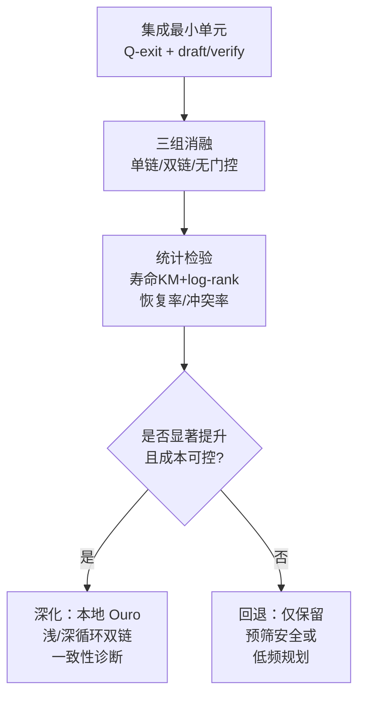
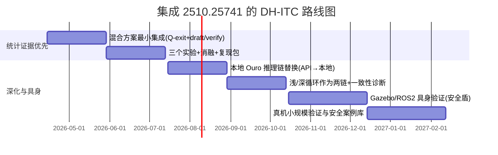

# 将 arXiv:2510.25741 的 LoopLM 融入“双螺旋思维链”闭环智能体实验计划的可行性与集成方案

**研究优先级建议：高。**  
若你的 DH-ITC 计划当前受限于“LLM 调用频率/成本/解释性”，2510.25741 提供的“可调深度的循环推理 + 早停门控 + 可观测中间预测”能直接变成双螺旋的“链间交织机制”和“计算预算旋钮”，值得优先集成与做消融验证。citeturn2view0turn4view1turn5view2turn7view0

**执行摘要（≤150字）**  
2510.25741 提出 LoopLM/Ouro：共享权重的循环深度推理、熵正则早停门控、以及“中间预测可当草稿/安全预筛”的部署优势。将其融入 DH-ITC，可把“双链交织”具体化为“浅循环草稿链 vs 深循环验证链”，并用 Q-exit 阈值实现自适应调用频率与成本控制；同时引入论文的“一致性/忠实性诊断”强化实验可证伪性。citeturn2view0turn4view1turn5view2turn10view4

## 论文要点与对 DH-ITC 的可复用映射

2510.25741（Zhu 等，2025）围绕一个核心点：**把“推理计算”从“输出更长的显式 CoT”转移到“隐藏表征的循环迭代”，并让模型学会“按输入难度分配循环深度”**。它给出的信息对 DH-ITC（双螺旋交织链）尤其重要，因为 DH-ITC 本质上也在做“按情境分配计算给规划/监控链”，并长期面对“链权重/调用频率坍塌”的问题。citeturn2view0turn4view1turn4view2

**论文关键贡献（按“可直接复用—可改造—不适用”分类）**

| 论文贡献维度 | 2510.25741 的做法（简述） | 对 DH-ITC 的价值 | 复用等级 |
|---|---|---|---|
| 架构 | Looped Language Model：同一层堆栈共享权重，循环执行 R 次；每步都有 LM head 与 exit gate，可“深度—参数量”解耦；并把循环深度作为第三条 scaling 轴。citeturn2view0turn4view1turn5view3 | **把“双链”落到“浅循环/深循环”两条链**：同一模型、不同循环步数即两条链，天然符合“双螺旋交织”。 | 直接复用（若用 Ouro） |
| 算法 I（Stage I） | **熵正则 + 均匀先验**训练 exit 分布，避免“总是用最深步数”的自强化坍塌；可解释为对 exit 步数的 ELBO/KL 正则。citeturn4view1turn10view6 | 直接映射到 DH-ITC 的“调用频率/交织频率/仲裁权重”学习：避免永远调用规划链或永远被维持链覆盖。 | 可改造 |
| 算法 II（Stage II） | 冻结 LM，仅训练 gate：用“多循环带来的损失改进”生成“继续/退出”标签，做 BCE 训练，使门控与真实收益挂钩。citeturn4view2turn4view4 | 可用于训练 DH-ITC 的**调用调度器**：是否再“多想一轮/多交织一次”由边际收益决定，而非固定 K。 | 可改造 |
| 推断/部署旋钮 | Q-exit：基于累计退出概率超过阈值 τ 决定退出；τ 是部署时“精度—算力—一致性—安全”单旋钮。citeturn10view4turn5view2 | 直接变成 DH-ITC 的**统一预算旋钮**：τ 控制“多深/多频/多验证”。 | 直接复用/可改造 |
| 草稿—验证与安全预筛 | 利用中间 step 的 predictor 作为“草稿模型”，最终 step 作为“验证模型”；可把**安全筛查前置**到草稿阶段，减少风险外溢。citeturn5view2turn5view3 | 极契合 DH-ITC 的“规划链 vs 维持链”：规划链出草稿，维持链做预筛/验证/拦截。 | 可改造（API可近似） |
| 实验与度量 | “早停策略”对比与 compute–accuracy 曲线；知识容量 vs 知识操控（样本效率）控制实验；安全（HEx-PHI）随循环步数提升；忠实性/一致性（Quora agreement matrix、probes）。citeturn4view4turn4view5turn4view6turn5view0turn5view1 | 给 DH-ITC 提供两类强指标：**(a) 预算—性能 Pareto 曲线**；**(b) “忠实性/一致性”诊断**用于反驳“只是事后编故事”。 | 直接复用（指标思路） |
| 开源与工程资产 | 提供 Ouro 1.4B/2.6B（含 Thinking 变体），Apache-2.0；可在 `config.json` 调 `total_ut_steps` 与 `early_exit_threshold`；但模型卡提示 vLLM 暂不支持 adaptive exit。citeturn6view0turn7view0turn9view0 | 让 DH-ITC **脱离大模型 API**，在有限硬件上实现“浅/深循环双链”；同时要处理 transformers 版本兼容与推理栈选择。citeturn7view0turn9view0 | 直接复用（但有约束） |

**哪些信息在论文/公开资产中仍“不够具体”，需要你用实验补齐？**

- **中间 step 输出的工程接口**：论文强调“中间 predictor 可作为草稿/安全预筛”citeturn5view2，但在你的 agent 系统中，需要明确“如何以低成本拿到 step-1 输出并复用 KV/缓存”。论文讨论 KV 缓存策略与推理优化citeturn3view0turn5view2，但开源代码页面标注“Code (Coming Soon)”citeturn6view0；因此短期内更现实的是：**用两次推理（浅步数/深步数）做近似**，并用性能-成本测量来判断是否值得做更底层的 KV 复用工程。
- **“专用 gate 训练”在 agent 场景的标签定义**：论文用“语言建模损失改进”构造 labelciteturn4view2turn4view4；而闭环 agent 中更自然的“改进信号”是寿命、恢复时间、违规率下降等。你需要把 Stage II 的“边际收益”改写为“边际生存收益/风险下降”，并通过消融验证其稳定性。

## 面向三种 DH-ITC 变体的具体集成方案

下面给出把 2510.25741 的 **5 个可操作技术点**（熵正则门控、增益门控、Q-exit 旋钮、草稿-验证+预筛、忠实性/一致性诊断）分别注入三种 DH-ITC 变体（并行对称、主从式、竞争仲裁）的落地计划。关键原则是：**让“论文技术”变成“模块+可消融开关+可度量旋钮”**。citeturn4view1turn4view2turn10view4turn5view2turn5view1

### 并行对称双链的集成

> 目标：两链同频交织，但避免“总是双调用”带来的成本爆炸；把 LoopLM 的“自适应深度”借来做“自适应交织”。

| 引入点（来自 2510.25741） | 代码/模块改动 | Prompt/Schema 改动 | 训练/评估改动 | 预期收益 | 风险 |
|---|---|---|---|---|---|
| 熵正则门控（uniform prior / entropy）citeturn4view1 | 新增 `InterleaveGate`：输出“本步是否需要双链都发言”的概率分布（或需要几轮交织）；加入 `entropy_bonus` 防坍塌 | 两链输出增加字段 `need_more_compute`/`continue_prob`（模仿 exit 概率） | 评估加入“交织率 vs 性能”曲线（Pareto） | 避免长期退化成“永远双调用”或“只剩一链” | 若 gate 训练信号弱，可能输出随机导致不稳定 |
| Stage II 增益门控（loss-improvement analog）citeturn4view2turn4view4 | `GainLabeler`：用“若本步发生盾拦截/险情”作为近似标签，训练 gate 学会“再交织一轮是否值得” | 在 schema 中让两链输出 `risk`、`confidence`，用于构造增益标签 | 对照组：固定 K vs 增益门控 | 在同 token/时延预算下提升恢复率/寿命 | 标签定义可能引入偏差（把“偶发噪声”学成“总要再想”） |
| Q-exit 阈值 τ 旋钮citeturn10view4turn5view2 | `QExitController`：累计继续概率超过 τ 则停止交织 | schema 加 `cum_continue`（或由控制器维护） | 做 τ 扫描，得到“寿命—成本—冲突率”三维前沿 | 给 DH-ITC 一个可部署的单旋钮（省钱/更安全） | τ 太小导致浅层决策；太大导致成本爆炸 |
| 草稿—验证 + 预筛citeturn5view2 | 规划链先输出 draft；维持链先做 safety-screen（不放行动）；若通过再让规划链 refine 或让维持链校验 | 引入 `draft_action`、`verdict` 字段 | 评估“未执行前被拦截比例”“灾难性失败率” | 显著降低“危险动作被执行”的概率 | 过度保守导致探索萎缩、多样性下降 |
| 忠实性/一致性诊断（agreement matrix）citeturn5view1 | `StepAgreementLogger`：记录每轮交织的候选动作与最终动作 | schema 要求输出 `action_signature`（可哈希） | 生成类似论文的“step-by-step agreement matrix”并比较单双链 | 把“真的在更新决策”变成可量化证据 | agreement 低也可能只是噪声，不一定更好 |

### 主从式双链的集成（最推荐的落地路径）

> 目标：把 2510.25741 的“浅循环草稿 vs 深循环验证”直接变成“维持链（快）vs 规划链（慢）”，并让调用频率随风险自适应。

| 引入点 | 代码/模块改动 | Prompt/Schema 改动 | 训练/评估改动 | 预期收益 | 风险 |
|---|---|---|---|---|---|
| 用 Ouro/LoopLM 实现“同一模型两种深度” | 维持链调用浅步数（相当于 step-1/2），规划链调用深步数（step-4 或更高）；若使用开源 Ouro，可用 `total_ut_steps` 与 `early_exit_threshold` 控制。citeturn7view0turn9view0 | 两次调用输出同一 JSON schema，便于仲裁 | 对照：同参数量非 LoopLM 或同模型固定深度 | **最接近论文“草稿-验证”原意**，且节省模型数量 | vLLM 暂不支持 adaptive exit，会迫使固定 full steps citeturn7view0 |
| Q-exit 做“是否升级到深规划”的旋钮citeturn10view4 | `DepthEscalator`：若浅调用给出高不确定/高风险，则触发深调用；τ 控制升级阈值 | schema 增字段：`uncertainty`、`risk`、`recommend_escalate` | 指标：升级率、升级带来的边际寿命增益、token/延迟 | 显著降低平均成本，同时在危险状态提供更深思考 | 若不确定性估计不准，会错过关键升级 |
| Stage I/II 门控思路改写为“状态难度→调用深度”citeturn4view1turn4view2 | 训练一个小 gate（本地）输入 (能量、速度、碰撞风险) 输出“升级概率”；用熵正则避免全升级或全不升 | schema 基本不变，只需要记录 gate 决策 | 评估：固定 K vs 自适应 K；曲线对比 | 形成可解释的“计算预算调度器” | gate 训练需要稳定标签（可用“升级后是否减少盾拦截/加速恢复”） |
| 忠实性诊断移植：看“浅→深”是否真的改决策citeturn5view1turn5view3 | 记录浅/深输出差异；构造“浅深一致性矩阵” | schema 增 `plan_version` 或 `depth_level` | 若深度增加但输出不变，可能只是“形式推理” | 强化“深度带来因果变化”证据链 | 输出变化未必更优，需要与回报关联分析 |
| 预筛安全：先用浅步数做“动作安全提案”，再深步数做“任务最优” | `SafetyFirst`：维持链先定安全可行动作集，再由规划链在集合内选 | schema 支持 `allowed_action_set`（可简写为 constraint） | 评估：违规率、灾难性失败率 | 与 SayCan 的“可行性约束”同构：先可行再有用citeturn14search2turn14search10 | 约束过紧可能限制探索与多样性 |

### 竞争/仲裁双链的集成

> 目标：把“中间 predictor 的一致性/可靠性”变成仲裁依据，使仲裁从“拍脑袋规则”升级为“有证据的可靠性仲裁”。

| 引入点 | 代码/模块改动 | Prompt/Schema 改动 | 训练/评估改动 | 预期收益 | 风险 |
|---|---|---|---|---|---|
| 可靠性仲裁：用“跨步一致性/收敛性”评分候选 | `ReliabilityArbiter`：候选若在浅→深 或 多轮迭代后稳定，则权重更高（模仿论文“答案逐步收敛到固定点”现象）。citeturn5view1turn10view4 | schema 要求每候选带 `confidence` + 可选 `stability_score` | 评估：仲裁后冲突率下降，且寿命不降 | 冲突更少、抖动更少，适合机器人 | 稳定≠正确，可能偏向保守错误 |
| 草稿-验证仲裁：把规划链草稿交给维持链验证（或反之）citeturn5view2 | `DraftVerifyArb`：每步先生成2–3候选（草稿），再用验证器筛掉高风险候选 | schema 支持 `candidate_list` | 评估：灾难性失败率、盾介入比例 | 更像“预筛安全”工作流 | 增加延迟，需事件触发 |
| 自适应候选数：用熵正则避免“总生成很多候选” | `CandidateGate`：决定本步生成几条候选（1–N），加熵正则 | schema 不变（控制器决定请求次数） | 评估：候选数—性能 Pareto | 控制成本并保留困难状态的搜索 | gate 学不好会过省或过奢 |
| 忠实性/一致性矩阵用于诊断“仲裁是否压制真实更新”citeturn5view1 | 记录“每链候选序列→最终执行” | schema 增 `arb_reason`（结构化） | 对照：无仲裁/硬优先级/可靠性仲裁 | 提供仲裁机制证据与可解释性 | 仍然可能被“解释性文本”伪装，需要结构化证据 |

**一个关键的“集成捷径”**  
在 DH-ITC 里，你不一定要真正维护两套模型：**用 Ouro 的“浅循环输出=维持链草稿/预筛，深循环输出=规划链验证/精化”**，可以把“双链”实现为“同一模型的两种循环深度”。这与论文中“中间 predictor 可作草稿、最终 predictor 作验证”几乎同构。citeturn5view2turn7view0turn9view0

## 三个针对性实验设计

三项实验都以“强化 DH-ITC 的可证伪性”与“把 2510.25741 的主张转化为 agent 侧证据”为目标：**恢复更快、冲突更低、样本效率更高**，并在统计上成立。

为保证对比公平，建议固定：环境版本、随机种子列表、总 token 预算或总 wall-clock 预算；并记录每次 LLM 调用的 tokens/延迟与 429 重试情况（若用 API）。速率限制与缓存策略需按 OpenAI 官方文档执行。citeturn12search3turn12search1

### 实验一：Q-exit 风格自适应“升级深度/交织频率”是否优于固定策略

**假设**  
在相同平均成本（tokens 或调用次数）下，采用 Q-exit 门控的主从式 DH-ITC（浅→深升级）相比固定 K 调用规划链，能显著提升中位寿命 \(\tilde{T}\) 与扰动恢复率 \(R\)。门控思想来自 2510.25741 的 Q-exit criterion 与“按输入难度分配循环深度”。citeturn10view4turn2view0

**设置**  
- 环境：会死的自维持虚拟体（能量/完整性可行域 + 扰动）。  
- 组别：  
  1) 固定 K（每 K 步调用规划链一次）  
  2) Q-exit 门控：浅调用每步/高频；满足条件才触发深调用  
- 若使用 Ouro：深度通过 `total_ut_steps`/`early_exit_threshold` 设定；若用 API：用“两段调用（draft/refine）+ 阈值”近似。citeturn7view0turn12search0

**指标**  
寿命生存曲线、恢复率 \(R\)、平均成本（tokens/episode、调用数/episode）、盾介入率、平均延迟。  

**样本量建议**  
≥30 seeds × 每 seed 50 episodes（确保死亡事件足够多用于生存分析）。  

**统计检验**  
- 生存曲线：Kaplan–Meier + log-rank（主检验）。citeturn15search23turn15search19  
- \(R\)：二项检验/Logistic 回归（控制扰动强度）。  
- 成本：Mann–Whitney U 或 Welch t-test（按分布）。  

### 实验二：草稿—验证 + 预筛安全是否显著减少“灾难性失败”与冲突率

**假设**  
把 2510.25741 的“proposal–verification + pre-emptive safety”思想迁移到 DH-ITC：规划链先产草稿动作序列，维持链在动作落地前做安全筛查/可行域检查并要求重写，可显著降低灾难性失败率（如一步进入不可恢复状态）与链间冲突率 \(C\)。citeturn5view2

**设置**  
- 竞争/仲裁变体：  
  A) baseline：两链各出一个候选，硬规则仲裁  
  B) draft–verify：规划链出 2–3 候选草稿，维持链对每个候选做“可行域预测/风险评分”，仲裁器选最优可行候选  
- 同预算：通过限制候选数或使用自适应候选门控（带熵正则）保持平均 tokens 接近。citeturn4view1turn12search1

**指标**  
灾难性失败率、盾介入率、冲突率 \(C\)、动作抖动 \(\sum\|a_t-a_{t-1}\|\)、恢复时间分布、成本。  

**样本量建议**  
≥20 seeds × 每 seed 100 episodes（灾难性事件相对稀少，需要更多回合）。  

**统计检验**  
- 灾难性失败率：卡方检验或 Fisher exact（若样本稀疏）。  
- 冲突率/抖动：Mann–Whitney U + bootstrap 置信区间。  

### 实验三：一致性/忠实性诊断——双螺旋是否真的“逐步更新并收敛”，而非先定结论再编理由

**动机**  
论文指出标准“Thinking/CoT 模型”可能在生成理由前就已决定答案，并用 step-wise probes 与 agreement matrix 展示 LoopLM 的中间决策会随循环加深而变化并逐步收敛。citeturn5view1turn4view8  
DH-ITC 的关键风险也类似：系统可能早早锁定动作，然后让另一条链写“监控解释”。因此需要“是否真的更新决策”的量化证据。

**假设**  
在相同输入状态上，DH-ITC 的“浅→深”或“多轮交织”会产生非平凡的决策变化轨迹（agreement < 1），并且最终趋于稳定；同时这种变化与回报提升相关（不是纯噪声）。若采用 Ouro 的浅/深循环实现，两层输出应呈现更“单调精化/更一致的收敛特征”。citeturn5view1turn5view3turn10view7

**设置**  
- 从训练后的 agent 采样 1,000 个代表性状态（含高风险状态）。  
- 对每个状态，分别运行：浅深度、深深度、以及“多轮交织”版本，记录动作签名。  
- 组别对照：单链、DH-ITC（无门控）、DH-ITC（Q-exit）。  

**指标与检验**  
- Step-by-step agreement matrix（像论文那样）与“收敛步数分布”。citeturn5view1turn10view7  
- “变化是否有益”：比较发生变化的状态中，后续 10 步累计回报/恢复概率是否上升（配对检验）。  

## 工程约束与缓解策略

把 2510.25741 融入 DH-ITC 会引入两类约束：**API/成本约束**与**本地推理栈约束**。你的策略选择取决于你是否愿意在本地跑 Ouro。

### 若继续用 LLM API（不本地跑 Ouro）

**主要约束**  
- **速率限制**：RPM/TPM/RPD/TPD 等任一先触顶都会限流；双链或多轮验证会显著增加请求数与 tokens。citeturn12search3  
- **延迟**：增加“草稿-验证”会将单决策延迟叠加，尤其在具身机器人上可能触发控制不稳定。  
- **复现性**：模型版本更新与采样随机性会影响统计结论，需要锁版本与记录请求。  

**缓解措施（建议默认开启）**  
- **Structured Outputs**：用 JSON Schema 强约束输出，减少闭环“格式漂移导致错误执行”。citeturn12search0turn12search4  
- **Prompt caching**：保持系统提示与固定前缀稳定；官方称可显著降低输入 token 成本并降低延迟（自动生效）。citeturn12search1  
- **Batch API**：对离线评估（如一致性矩阵计算、候选生成）用 Batch，官方文档明确 50% 成本折扣并提供更高吞吐，但非实时。citeturn12search22  
- **分层调用**：把 LLM 从“每步控制器”退到“事件触发的宏规划器”（这也更符合主从式 DH-ITC）。citeturn14search2turn14search10  

### 若本地跑 Ouro（直接复用 LoopLM）

**收益与约束并存**  
- Oro 模型（1.4B/2.6B、Thinking 变体）Apache-2.0；并提供可调 `total_ut_steps` 与 `early_exit_threshold`，天然支持“浅/深循环双链”。citeturn7view0turn7view1turn9view0  
- 但模型卡强调：建议使用 `transformers==4.54.1` 或更早，且提示 `transformers<4.56.0`；这是明确的工程兼容性约束。citeturn7view0turn9view0  
- 另一个关键点：模型卡提示 vLLM 当前不支持 adaptive exit，会总是执行 full `total_ut_steps`。如果你依赖“按难度早停”，就必须用 HF Transformers 或自己改推理栈。citeturn7view0turn9view0  

## 更新三类原型设计与资源增量估算

这里给出你原先的三类原型（纯模拟、混合、具身）在引入 2510.25741 技术后需要增加/替换的模块，以及相对增量（开发时间、调用成本或算力）。

为避免把增量估算写成“拍脑袋”，我把它分成“必选改动”与“可选增强”；你可以按实验一的门控结论决定是否继续做增强。citeturn4view4turn10view4

### 纯模拟原型（双 LLM 链在 Gym 环境中）

**模块级变化**  
- 增加 `QExitController`：控制“交织轮数/升级深度”。（对应 Q-exit）citeturn10view4  
- 增加 `DraftVerifyPipeline`：规划草稿→维持预筛→必要时再规划精化。（对应 proposal–verification + pre-emptive safety）citeturn5view2  
- 增加 `StepAgreementLogger`：输出一致性矩阵。（对应论文一致性度量）citeturn5view1  

**资源增量（相对“单调用规划链”基线）**  
- 若用 API：平均调用次数约增加到 \(1 + p_{escalate}\)（草稿必调用 + 需要时验证），token 与延迟按比例上涨；用 prompt caching 可抵消重复前缀成本。citeturn12search1turn12search3  
- 若改用本地 Ouro：token 成本趋近 0，但需要本地推理资源；Ouro 的循环步数越高，单次推理计算越高（深度是 scaling 轴）。citeturn2view0turn7view0  
- 开发时间：2–5 天（主要在日志/消融/统计脚本）。

### 混合原型（LLM 高层链 + 本地维持链）

这是**最推荐**的集成落点，因为它最大化利用了 2510.25741 的“浅/深草稿-验证”概念，同时把高频动作控制留在本地，规避 API 速率限制与实时性问题。citeturn12search3turn14search2

**模块级变化**  
- 维持链：本地规则/小网络不变，但新增“预筛接口”，可把“危险动作/高风险宏目标”拦截并回传给规划链。  
- 规划链：  
  - 若用 API：实现“两阶段规划（draft/refine）+ Q-exit”。  
  - 若用 Ouro：用同一模型的浅/深循环充当两条链（最贴合论文）。citeturn7view0turn9view0turn5view2  

**资源增量（粗略）**  
- API 路线：成本主要来自“额外 refine 调用”；用 Batch 做离线评估可降本。citeturn12search22  
- Ouro 路线：需要本地推理环境与兼容 transformers 版本；若追求吞吐用 vLLM 则失去 adaptive exit。citeturn7view0turn9view0  
- 开发时间：3–10 天（加入门控、消融、统计）。

### 具身原型（机器人并行运行两链，含安全仲裁）

**模块级变化**  
- ROS2 节点拆分：`planner_node`（低频、可浅/深两段）、`maintain_node`（高频控制）、`shield_node`（安全仲裁与急停），并记录 rosbag。  
- 把 2510.25741 的“预筛安全”思想落地为：在发送 `cmd_vel` 前，盾节点对候选速度/轨迹做约束与可行域预测；若不满足，触发“再规划/降级到安全模式”。citeturn5view2turn15search1  
- 关键工程约束：LLM 必须低频（事件触发）；否则延迟会侵入控制环。citeturn12search3  

**资源增量**  
- 额外开发时间：2–6 周（与安全测试/场地高度相关）。  
- 若用 API：网络抖动与速率限制会显著影响稳定性；若用本地 Ouro：硬件与推理栈维护增加，但实时性更可控。citeturn12search3turn7view0  

## 理论含义与负结果解释

从理论上，2510.25741 对 DH-ITC 的支持主要在三个层面：

- **功能主义（functionalism）**：功能主义把“心智状态”视为由其在系统中的功能角色决定；LoopLM 展示“同一参数预算下，通过改变计算组织（循环深度与门控）会系统性改变能力”，这与 DH-ITC 的“结构/组织优先”立场一致。citeturn13search0turn2view0  
- **涌现与组织复杂度**：论文把“循环深度”作为能力增长的新轴，并显示门控策略、深度分配与性能出现系统性关系；在 DH-ITC 中，“链间交织深度/频率”也可被视为类似的组织轴，出现非线性提升时更接近涌现论的经验期待。citeturn13search1turn4view4  
- **可行域/自维持（viability）**：论文强调安全随循环深度提升，并提出“预筛安全”部署优势；在 DH-ITC 的自维持环境里，可行域是硬边界，预筛机制能直接转化为“减少越界/死亡”。这与可行性理论对“在约束下保持演化可行”的核心关切一致。citeturn5view0turn5view2turn15search1  

**但它也对 DH-ITC 提出一个“挑战性解释”**：LoopLM 的推理提升主要来自**模型内部的循环计算与门控**，并不依赖外部闭环环境；因此若你的 DH-ITC 实验在闭环上看不到优势，可能表明：  
- 你的任务主要瓶颈在“内部推理/操控”而非“闭环结构”；或  
- 你的闭环/自维持设定太弱（没有把控制结构的价值拉出来）；或  
- 双链交织引入的延迟/噪声抵消了推理收益。citeturn2view0turn4view6turn15search1  

**负结果应如何解释（避免过度否定）**  
- 若“引入 Ouro/门控后，寿命不升但成本升”：更可能是“门控/仲裁策略不正确”或“环境不需要深推理”，而不代表“双螺旋无效”。你应先查看一致性矩阵：深度是否真的改变决策？若没有改变，则问题在“没用上深度”；若改变但不增益，则问题在“改变方向不对”。citeturn5view1turn10view4  
- 若“冲突率降低但恢复率也降低”：可能说明仲裁过度保守，探索链被压制。此时可用熵正则与风险预算重新平衡探索-维持。citeturn4view1turn12search1  

## 实施路线图与决策门

为保证你能在 3 个月内获得可发表/可复现实证，我建议用“决策门（decision gates）”把是否继续深集成（例如本地 Ouro 推理优化）与“先拿到统计结论”解耦。

### 关键技术路径图（Mermaid）



### 三个月路线（聚焦“先证伪/证成”）

| 月份 | 里程碑（MVD） | 决策门 |
|---|---|---|
| 第一个月 | 混合方案跑通：draft/refine + Q-exit；输出结构化 JSON；产出第一版生存曲线与成本统计 | 若成本爆炸或无差异：立即降低调用频率/改事件触发 |
| 第二个月 | 完成实验一、二；完成消融；输出 Pareto 曲线（寿命-成本-冲突）与显著性 | 若仅在高扰动条件下提升：把“扰动强度”写成结论边界 |
| 第三个月 | 完成实验三并写“忠实性/一致性”章节；固化复现脚本与配置记录 | 若一致性指标显示“无更新”：优先改门控/仲裁而非换模型 |

### 十二个月路线（决定是否“本地 Ouro 作为核心推理栈”）



## 参考文献与附录代码

下面列出优先级最高的参考（8–12条，中文优先，其次英文/原文）。每条都对应你报告中可直接引用的关键点。

**中文优先（理论动机与系统综述）**  
1) 艾炎等，《推理判断中双重加工过程的协作与转换机制》（《心理科学进展》2018）：系统梳理 Type1/Type2 双加工与切换机制，为 DH-ITC 的“规划链 vs 维持链”提供认知动机与术语对齐。citeturn11search0  
2) 殷昌盛等，《多智能体分层强化学习综述》（《智能系统学报》2019）：提供分层/多智能体决策框架与常见问题，为“主从式/仲裁式”DH-ITC 的实验消融提供中文背景。citeturn11search1  
3) 陈旭，《基于大语言模型的自主智能体概述》（CCL 2024）：总结 LLM-agent 的通用范式（记忆/规划/行动/评估），便于把 DH-ITC 写成“范式内的结构化变体”。citeturn11search2  
4) 王文晟等，《基于大模型的具身智能系统综述》（《自动化学报》2025）：提供具身智能系统架构与评估要点，支撑“具身 DH-ITC + 安全仲裁”的落地章节。citeturn11search10  

**英文/原文（核心机制与可复现实现）**  
5) Zhu et al., 2025, arXiv:2510.25741《Scaling Latent Reasoning via Looped Language Models》：LoopLM/Ouro 的循环推理、熵正则门控、Q-exit、草稿-验证与忠实性/一致性诊断，是本报告的集成对象。citeturn2view0turn4view1turn5view2turn5view1  
6) Ouro 模型卡（Apache-2.0、可调 `total_ut_steps`/`early_exit_threshold`、transformers 版本约束、vLLM 不支持 adaptive exit）：为“本地浅/深循环双链”提供直接工程入口与限制。citeturn7view0turn9view0  
7) Yao et al., 2022/2023, arXiv:2210.03629《ReAct》：推理与行动交织的范式前身，用于对照“单链交织 vs 双链交织”的差异。citeturn14search0  
8) Wang et al., 2023, arXiv:2305.16291《Voyager》：黑箱 LLM 闭环、技能库与迭代提示，证明“无需训练大模型也能形成闭环能力增长”，适合作为 DH-ITC 扩展参照。citeturn14search1  
9) Ahn et al., 2022, arXiv:2204.01691《SayCan》：把语言模型概率与价值/可行性概率融合选择技能，是 DH-ITC 仲裁与预筛安全的直接同构范例。citeturn14search2turn14search10  
10) Aubin et al., 2011《Viability Theory: New Directions》：定义“可行域”与在约束下维持演化的数学语言，为 DH-ITC 的“会死/自维持”判据提供理论基座。citeturn15search1  
11) Keramati & Gutkin, 2014, eLife 10.7554/eLife.04811：将稳态维持形式化为可优化目标（homeostatic RL），用于设计维持链的 reward/drive。citeturn15search0  
12) OpenAI API 文档（Structured Outputs / Prompt caching / Rate limits / Batch）：用于双螺旋在 API 方案下实现结构化动作输出、成本下降与吞吐控制；尤其 prompt caching 与 batch 在你做大规模统计时是硬要求。citeturn12search0turn12search1turn12search3turn12search22  

### 附录：混合 DH-ITC 的“Q-exit + 草稿-验证”Python 伪代码补丁（40–120行）

下面展示一个**可直接嵌入你现有 mixed prototype**的 wrapper：  
- 使用 **Structured Outputs** 强制 JSON schema（避免闭环执行错误）。citeturn12search0  
- 通过“草稿→验证（可选）”近似 2510.25741 的 **proposal–verification**，并用 `p_continue` 和阈值 `TAU` 实现 **Q-exit** 风格早停旋钮。citeturn5view2turn10view4  
- 通过保持 system prompt 不变来利用 **prompt caching**（自动生效，无需专门 API 参数）。citeturn12search1  

```python
import os, time, json, random
from typing import Dict, Any
from pydantic import BaseModel, Field
from openai import OpenAI  # pip install openai

# ---------------- Repro config ----------------
SEED = int(os.getenv("SEED", "0"))
random.seed(SEED)
TAU = float(os.getenv("TAU", "0.75"))          # Q-exit threshold (deployment knob)
MAX_ROUNDS = int(os.getenv("MAX_ROUNDS", "2")) # draft + at most 1 refine
PLAN_EVERY = int(os.getenv("PLAN_EVERY", "20"))# low-frequency planning baseline

MODEL = os.getenv("MODEL", "gpt-5.4-mini")     # pin a specific model in real runs
client = OpenAI()

# Keep system prompt stable + long-ish to benefit prompt caching automatically
SYSTEM_PLANNER = (
  "You are the Planning Strand in a closed-loop self-maintaining agent.\n"
  "Return ONLY JSON following the schema. Be concise.\n"
  "If risk is high or the plan is uncertain, set p_continue close to 1.\n"
  "If confident and safe, set p_continue close to 0.\n"
) * 20

# ---------------- Structured output schema ----------------
class PlanJSON(BaseModel):
    goal: str
    horizon: int = Field(ge=1, le=100)
    macro_action: str
    constraints: Dict[str, Any]
    risk: float = Field(ge=0.0, le=1.0)
    confidence: float = Field(ge=0.0, le=1.0)
    p_continue: float = Field(ge=0.0, le=1.0)  # analog of "continue/exit" probability

def summarize_state(obs: Dict[str, float], last_goal: str) -> str:
    # Keep summary short to reduce tokens
    return (f"t={obs['t']}, energy={obs['e']:.2f}, integrity={obs['q']:.2f}, "
            f"pos=({obs['x']:.2f},{obs['y']:.2f}), last_goal={last_goal}")

def call_planner(summary: str, mode: str, draft: PlanJSON | None = None) -> tuple[PlanJSON, Dict[str, Any]]:
    user = {"role": "user", "content": summary + f"\nmode={mode}"}
    if draft is not None:
        user["content"] += "\nDRAFT_JSON=" + draft.model_dump_json()

    t0 = time.time()
    resp = client.chat.completions.parse(
        model=MODEL,
        messages=[{"role": "system", "content": SYSTEM_PLANNER}, user],
        response_format=PlanJSON,
        temperature=0.2,
    )
    dt = time.time() - t0
    plan = resp.choices[0].message.parsed
    usage = getattr(resp, "usage", None)
    meta = {"latency_s": dt, "usage": usage.model_dump() if usage else {}}
    return plan, meta

def q_exit_rounds(base_plan: PlanJSON) -> bool:
    # Q-exit-style: if p_continue is low enough, stop refining
    return base_plan.p_continue < TAU

# ---------------- Integration point into mixed DH-ITC loop ----------------
def dh_itc_step(obs: Dict[str, float], last_goal: str, local_maintain_fn, shield_fn,
                t: int, goal_cache: PlanJSON | None) -> tuple[PlanJSON, Dict[str, Any], Any]:
    logs = {"t": t}
    # Low-frequency planning + event-trigger (example: low energy)
    need_plan = (t % PLAN_EVERY == 0) or (obs["e"] < 0.25)

    if goal_cache is None or need_plan:
        # Round 1: draft
        draft, meta1 = call_planner(summarize_state(obs, last_goal), mode="draft")
        logs["draft_meta"] = meta1
        plan = draft

        # Optional Round 2: refine/verify (proposal–verification analogue)
        if (not q_exit_rounds(draft)) and MAX_ROUNDS > 1:
            refine, meta2 = call_planner(summarize_state(obs, last_goal), mode="refine", draft=draft)
            logs["refine_meta"] = meta2
            plan = refine
    else:
        plan = goal_cache

    # Local maintain chain executes micro-action under constraints
    a0 = local_maintain_fn(obs, plan)
    a  = shield_fn(a0, obs, plan)  # pre-emptive safety: block unsafe actions
    logs["plan"] = plan.model_dump()
    logs["a0"] = a0
    logs["a"] = a
    return plan, logs, a
```

**这段补丁对应的“论文技术点”**  
- `p_continue` + `TAU` 是系统级的 Q-exit 旋钮（对应论文的 Q-exit threshold）。citeturn10view4  
- `draft/refine` 是 proposal–verification/预筛思路的 agent 级实现（对应论文的“草稿-验证与安全前置”讨论）。citeturn5view2turn5view3  
- 结构化输出与缓存策略用于让双螺旋的“交织”具备工程可靠性与可统计复现。citeturn12search0turn12search1turn12search3